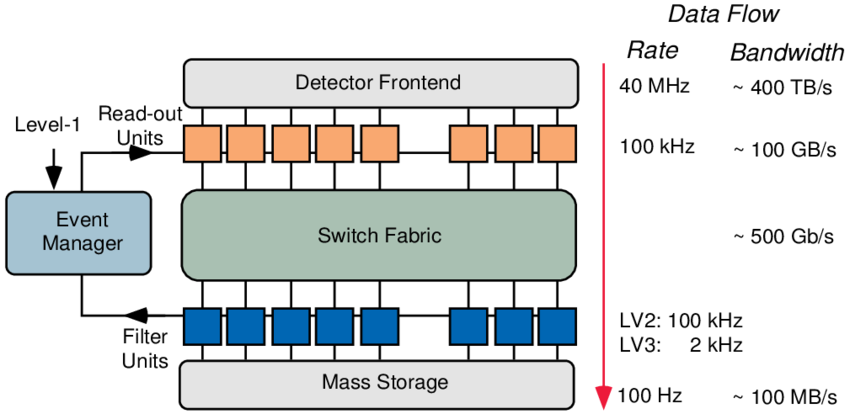
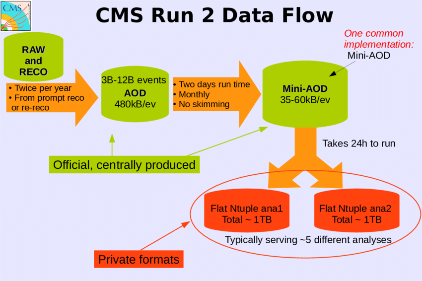

# NanoAOD format

Traditionally, the data flow in the CMS experiment is optimized for the selection, calibration, and reconstruction of physical events, following a well‑established processing chain. This chain includes the data acquisition process, illustrated in [Figure 1](#fig-cms-daq), after which the data undergo a reconstruction and progressive reduction workflow that produces several data formats. Each format is designed for a specific level of analysis within the experiment.

<figure markdown id="fig-cms-daq">
  
    <figcaption>
        Figure 1: Architecture of the CMS data acquisition (DAQ) system.
    </figcaption>
</figure>
	  
In the early stages, the RAW and RECO formats are produced. These formats contain low‑level information close to the original detector signals and the detailed reconstruction of physical objects. They are mainly used for calibration tasks, detector validation, and studies that require full access to machine‑level information.

As the data move further along the processing chain, more compact and analysis‑oriented representations are generated, such as AOD, MiniAOD, and NanoAOD. These formats include higher‑level physical variables, such as reconstructed objects, identification flags, and derived quantities, and are optimized for statistical analyses and phenomenological studies.

This hierarchical workflow, illustrated in [Figure 2](#fig-data-formats), strikes a balance between information richness and the need for computational and storage efficiency when analyzing large volumes of data.

<figure markdown id="fig-data-formats">
  
    <figcaption>
        Figure 2: CMS data formats.
    </figcaption>
 </figure>

At present, NanoAOD is the most compact and accessible data format available. In contrast to AOD and MiniAOD, which are larger and whose variables are stored as CMSSW‑specific object types, NanoAOD is a semi‑structured format composed of flat arrays.

As a result, NanoAOD files can be read outside the CMS software environment, and the transition from this format to representations compatible with machine learning models is much more straightforward compared to other CMS data formats.

## ROOT files and TTree

All these datasets are stored in the .root file format, provided by ROOT. [ROOT](https://root.cern/doc/v636/) is a data analysis framework created by René Brun and Fons Rademakers in 1995 at CERN, designed to efficiently store, access, process, visualize, and analyze very large volumes of data, a long standing challenge at CERN due to the massive amount of information produced in particle collisions.

A ROOT file can contain several types of data structures. However, NanoAOD files consist exclusively of tree‑like structures, known as [TTrees](https://root.cern.ch/root/htmldoc/guides/users-guide/Trees.html). These structures can be understood as tables stored in a columnar layout.

The main TTree is called `Events`, which contains all the relevant particle‑level information used in physics analyses. Additional TTrees are auxiliary and, in most cases, include `LuminosityBlocks`, `Runs`, `MetaData`, and `ParameterSets`. However, they are not limit to just these TTrees.

## Branch structure in NanoAOD

As shown in [Figure 3](#fig-tree), this type of data representation can be considered loosely structured and may become highly complex. Nevertheless, NanoAOD files are composed exclusively of branches, which can be interpreted as columns in a dataset.

<figure markdown id="fig-ttree">
  
    <figcaption>
        Figure 3: TTree structure.
    </figcaption>
</figure>
	  
Each event (*i.e.*, each dataset instance) can store either:

* Scalar values

* One‑dimensional arrays of fixed length

* One‑dimensional arrays of variable length

The length of array‑type branches may vary from event to event. Each branch is associated with a specific data type, such as `bool`, `int32`, `uint64`, `float64`, and others, depending on the nature of the stored information.

This simplified yet flexible structure is a key feature that makes NanoAOD particularly suitable for modern data analysis workflows and machine learning applications.