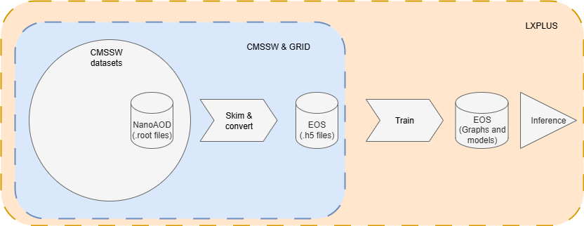

# CMS Machine Learning Framework

This repository provides a framework for processing, training, and making inferences with machine learning models in the context of CMS experiments. The framework facilitates data preparation, model training, and evaluation to support ML-based analyses in high-energy physics.

## Features

- **NanoAOD Filtering**: Scripts for selecting relevant events and producing key physics variables.
- **Data Preparation**: Merging filtered NanoAOD samples and converting them into HDF5 format for efficient ML model training.
- **Model Training & Evaluation**: Training machine learning models and performing performance tests to assess their effectiveness in anomaly detection or other tasks.

## Diagram



This diagram illustrates the tool's structure. The data processing section uses the CMSSW and GRID systems, but the training section does not.

## First steps

Before starting, you need to create the environment and clone the GitHub repository. If you already have all your data prepared, simply clone the repository and proceed to [training section](training/01_intro.md), where you will find two options: running the training in LXPLUS and outside LXPLUS.  

### Log into LXPLUS server (CERN computers)

```bash
ssh username@lxplus.cern.ch
```

### Set up the required CMSSW version

```bash
cmsrel CMSSW_13_3_0
cd CMSSW_13_3_0/src
cmsenv  
```

You will see many of directories inside `CMSSW_13_3_0/`, but you only need to work inside `src/` directory.

!!! warning "IMPORTANT"
    1. `cmsenv` needs to be executed every time you open a new terminal to activate the environment variables. You need to be inside `CMSSW_13_3_0/` directory.
    2. The [Data processing section](data_processing/01_set_config.md) has been tested only with the CMSSW_13_3_0 release. The training section is not affected.

### Clone the repository and compile 

```bash
git clone https://github.com/castaned/ML-integration-CMSSW DeepNTuples
scram b -j N
```

Make sure not to change the name `DeepNTuples` for your local directory containing the GitHub repository, otherwise, it will not work. In the second command, `N` represents the CPUs to use for compiling and building the code inside `src/` directory, which uses dependencies from the CMSSW system. If you are unsure about `N`, simply run `scram b` without the `-j` flag, it will use all the available CPUs.


!!! note "Resources"
    If you want to learn more about the CMSSW system, its structure, and commands, you can explore [Intro to CMSSW](https://cms-opendata-workshop.github.io/workshop2022-lesson-cmssw/) and [CMSSW SCRAM](https://twiki.cern.ch/twiki/bin/view/CMSPublic/SWGuideBuildFile).
