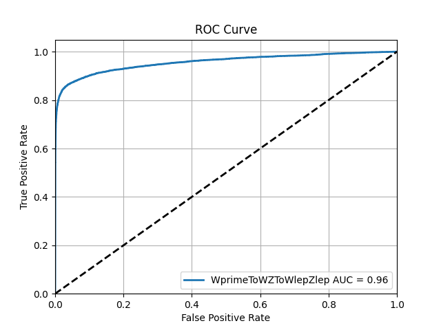

# Complete workflow

This section demonstrates an end-to-end example of running the complete workflow, data processing, root into HDF5 conversion, and ML model training.

We assume the following:

- You have a LXPLUS account and a GRID certificate.
- You already know the FLN of your datasets.
- You have set up your CMSSW environment and are inside the `src/` directory.
- You have your processing scripts for your specific analysis.


First, clone the GitHub repository:

```bash
git clone https://github.com/castaned/ML-integration-CMSSW <directory_name>
cd <directory_name>

```

You can choose any `<directory_name>` you like. In this example `<directory_name>` will be `ml_framework`.

!!!Info
    Remember that all example files can be found in the `example_files` directory of the repository.
   
First, we processed and convert the data. We move to the data processing directory:

```bash
cd data_processing
```

Knowing the FLN, and having the processing script, we can process the data by modifying the YAML file `data_processing_config.yaml`:


```yaml
---
proxy:
  generate: 1 # 1 yes, 0 no
  voms: "cms"
  proxy_time: "192:00"
  proxy_path: "$HOME/.globus/x509up_$(id -u)"

data_processing:
  condor_params:
    executable_file: "run_filter.sh"
    cpus: 1
    gpus: 0
    mem: 1.5GB
    disk: 2GB
    job_flavour: "espresso" # 20 minutes
  processing_script: "src/ml_framework/new_dataproc/example/filterNanoAOD.py"
  eos_output_dir: "/eos/user/v/vminjare/test_dataprocessing"
  afs_cms_base: "/afs/cern.ch/user/v/vminjare/CMSSW_13_3_0"
  redirector: "cms-xrd-global.cern.ch"
  datasets:
    - FLN: "/ZGToLLG_01J_5f_TuneCP5_13TeV-amcatnloFXFX-pythia8/RunIISummer20UL18NanoAODv9-106X_upgrade2018_realistic_v16_L1v1-v1/NANOAODSIM"
      ID: 0
      amount: 3 # -1 is all ROOT files
    - FLN: "/WprimeToWZToWlepZlep_narrow_M1000_TuneCP5_13TeV-madgraph-pythia8/RunIISummer20UL18NanoAODv9-106X_upgrade2018_realistic_v16_L1v1-v1/NANOAODSIM"
      ID: 1
      amount: -1
```

!!!info
    Indentation in YAML files is very important, and YAML files do not accept tabs.


The main processing script, `processing_script`, in this case `filterNanoAOD.py`, must satisfy the following conditions:

- It must accept exactly the following arguments **input file path**, **FLN**, **OUTPUT DIRECTORY** in this order.
- It must have a dataset labels branch taht start at 0 and increase sequentially without gaps, as the mapping declare in the `datasets` section in the YAML file.

For more information, check the [dataset processing section](data-processing/somewhere).

If your GRID proxy certificate is still valid, do not generate a new one. Change `generate: 1` to `generate: 0` under the `proxy` section.

In this example, I have two files to process the data:

```bash
example/
├── branchsel.txt
└── filterNanoAOD.py
```

In general terms, this analysis file selects events containing **at least three leptons** (electrons and/or muons), classifies the events into categories according to the lepton composition, and computes composite variables derived from the leptonic information.

These variables include the reconstructed invariant mass of the three-lepton system, the total momentum, and other kinematic quantities that allow the definition of the region of interest in the search for specific exotic particles. This procedure is performed independently for each sample, LFN in the YAML file.

Now we submit the jobs, one per ROOT file to process:

```bash
python3 execute_data_processing.py -f data_processing_config.yaml
```

When you execute the Python script, it first creates a tar archive of the entire `afs_cms_base` directory and uploads it to `eos_output_dir`. This step is performed locally in your current shell and may take several minutes. Once the jobs are submitted to HTCondor, you can monitor their status using `condor_q`. Also, the logs are stored in `logs/`. After all the jobs finish, the new ROOT file will be in the directory specified by `eos_output_dir`.

Now we convert the ROOT file into HDF5 files. First, we go to the directory:

```bash
cd convert_h5
```

As before, configure the YAML file, for this part `root2h5_config.yaml`. For example:

```yaml
---
convertion:
  input_dirs:
    - "/eos/user/v/vminjare/test_dataprocessing/WprimeToWZToWlepZlep_narrow_M1000_TuneCP5_13TeV-madgraph-pythia8_RunIISummer20UL18NanoAODv9-106X_upgrade2018_realistic_v16_L1v1-v1_NANOAODSIM"
    - "/eos/user/v/vminjare/test_dataprocessing/ZGToLLG_01J_5f_TuneCP5_13TeV-amcatnloFXFX-pythia8_RunIISummer20UL18NanoAODv9-106X_upgrade2018_realistic_v16_L1v1-v1_NANOAODSIM"

  tree_name: "Events"

  branches: "all"
 
# If you do not have jagged arrays leave it blank. If you use, the default value is 10
  max_jagged_len:
  
  eos_output_dir: "/eos/user/v/vminjare/test_conversionh5"

condor_params:
  executable_file: "run_conversion.sh"
  cpus: 1
  gpus: 0
  mem: 1.5GB
  disk: 2GB
  job_flavour: "espresso" # 20 minutes
```

For both conversion and training, a custom Python environment is required. We use containers for this. Before submitting the job, buil the container:

```bash
apptainer build conversion_container.sif conversion_container.def
```

This stage needs to run some code in the current shell, which requires Python libraries not available by default. These libraries are present in the CMSSW environment, so run `cmsenv` before submitting the jobs:

```bash
cmsenv
python3 execute_convert_root2h5.py -f root2h5_config.yaml
```

When the jobs finish, your HDF5 files will be in `eos_output_dir`. If there is some problem, you can check the logs in the `logs/` directory.

With the processed HDF5 data, we can create, optimize, and train our ML model. Go to the training directory:

```bash
cd ml_framework/ml_training
```

Training can be done with HTCondor, SLURM, our directly on any a server or compute.. In this example, wel run the training in LXPLUS, so we need to configure both a YAML file and a HTCondor submission file.

!!!Important
    Note that the `input_paths` variable in the YAML configuration file does not reference EOS paths (*e.g.* `/eos/user/v/vminjare/`), as this part of the framework is not tightly coupled to CERN-specific systems. Access to EOS is instead handled through the HTCondor submission file, which ensures that the appropriate environment and filesystem access are available at runtime.

- `ml_model_config.yaml`:

```yaml
---
data:
  input_paths:
    - "test_conversionh5/WprimeToWZToWlepZlep_narrow_M1000_TuneCP5_13TeV-madgraph-pythia8_RunIISummer20UL18NanoAODv9-106X_upgrade2018_realistic_v16_L1v1-v1_NANOAODSIM"
    -  "test_conversionh5/ZGToLLG_01J_5f_TuneCP5_13TeV-amcatnloFXFX-pythia8_RunIISummer20UL18NanoAODv9-106X_upgrade2018_realistic_v16_L1v1-v1_NANOAODSIM"


  output_path: "results"

  features:
    - "A_Dr_Z"
    - "A_Zmass"
    - "MET_pt"
    - "B_Zmass"
    - "B_Dr_Z"


  label: "Dataset_ID"

  num_classes: 2

  # Leave this blank if you do not want to apply a mapping
  label_mapping: "short_name_mapping.json"

model:
  name: "mlp_binary_test"

  type: "mlp"

  ideal_accuracy: 95

  num_models: 3
```

- `lxplus_template.jdl`

```yaml
# HTCondor Submission File

environment = \
    EOS_INPUT_DIR=/eos/user/v/vminjare/test_conversionh5; \
    EOS_DIR=/eos/user/v/vminjare/outputs/$(ClusterId); \
    REDIRECTOR=root://eosuser.cern.ch; \
    RESULTS_DIR=results/

#notify_user             = email@email.com
notification            = Complete
universe                = vanilla
executable              = lxplus_run_template.sh
should_transfer_files   = YES
when_to_transfer_output = ON_EXIT
transfer_input_files    = ./
x509userproxy = $ENV(X509_USER_PROXY)
output                  = job.$(ClusterId).$(ProcId).out
error                   = job.$(ClusterId).$(ProcId).err
log                     = job.$(ClusterId).$(ProcId).log
request_cpus            = 5
request_gpus            = 1
+JobFlavour = "microcentury"
queue
```

Now build the container:

```bash
apptainer build ml_container.sif ml_container.def
```

This may take a few minutes. Once the `.sif` file is ready, export the proxy certificate to be able to have access to XRootD:

```bash
export X509_USER_PROXPROXY=/afs/cern.ch/user/v/vminjare/.globus/x509up_u170903
```

Finally, submit the job:

```bash
condor_submit lxplus_template.jdl
```

HTCondor logs will be created where we submitted the job. However, the scrpit generate its own logs files, stderr.log and stdout.log, they will be in `output_path/` along MLflow runs, plots, models files, and all result generated. If everythong went well, you will see the ROC curve and confusion matrix as follows:

<div class="grid" markdown>

<figure markdown id="fig-roc">
  { width="87%" }
    <figcaption>
        Figure 3: ROC curve for the binary MLP classifier.
    </figcaption>
</figure>

<figure markdown id="fig-cm">
  { width="100%" }
    <figcaption>
        Figure 4: Confusion matrix for the binary MLP classifier.
    </figcaption>
</figure>

</div>


Finally, if you want to inspect the MLflow runs, copy `output_path/mlruns/` and the `ml_container.sif` to your computer and run:

```bash
apptainer exec ml_container.sif mlflow ui --backend-store-uri mlruns/ --host localhost --port 8100
```

The MLflow UI will then be available at `localhost:8100` in your web browser.

<figure markdown id="fig-mlflow">
  
    <figcaption>
        Figure 1: MLFlow experiments.
    </figcaption>
</figure>
	  